# 📚 Who Am I? (professional)

### 💻 Product-oriented frontend software engineer.

### ⭐ 11+ years of professional experience, 20+ years coding.

### ✅ Focused on building testable, scalable, and maintainable codebases.

### 👷 Always chasing state-of-the-art experiences and questionable side projects.

<h1>👤 Who am I? (personal)</h1>

<h3>💿 <a  href="https://youtu.be/nsAtk0cW7J0?t=2240"  target="_blank">Techno</a> enthusiast</h3>

> **"Techno is spiritual. It’s tribal. It’s futuristic. It’s primitive. It’s everything at once."**
>
> *Laurent Garnier (techno pioneer)*

<h3>🌲 <a  href="https://youtu.be/9vnQsTRrJuw?t=378"  target="_blank">Hiking</a> enjoyer </h3>

> **"In every walk with nature one receives far more than he seeks."**
>
> *John Muir (naturalist)*

<h3>⛺ <a  href="https://www.youtube.com/shorts/91j-757stQo"  target="_blank">Prepper</a> aficionado</h3>

> **"Expect the best. Prepare for the worst. Capitalize on what comes."**
>
> *Zig Ziglar (motivational speaker)*

<h3>🐶 <a  href="https://www.youtube.com/shorts/hnyteFE6oRw"  target="_blank">Dog</a> petter</h3>

> **"If there are no dogs in Heaven, then when I die I want to go where they went."**
>
> *Will Rogers (Humorist)*

<h3>🙂 <a  href="https://www.youtube.com/shorts/hzrnnclOFb8"  target="_blank">Positive</a> person</h3>

> **“Be kind, for everyone you meet is fighting a hard battle.”**
>
> *Ian Maclaren (theologian)*

# ☎️ How to contact me?

Feel free to reach out, I’m always open to a good conversation or a promising opportunity.

# 🔍 Where do I want to apply my skills?

I want to have an impact, not just in technology or business, but in people. I'm drawn to meaningful problems, and I believe software can be a force for good when it's built with empathy and purpose.

 🌍 **Nonprofits and social impact tech**

 I want to apply my skills in environments where the primary goal is improving lives, not maximizing margins. I’m especially motivated by work that supports vulnerable communities or solves critical real-world problems.

🤝 **Collaborative economy**

I'm interested in the collaborative economy platforms that create new opportunities for people, especially those who have been excluded from traditional systems. Whether it’s flexible work, income streams, or access to services, I see this as a way to empower individuals through technology.

🎓 **EdTech and Learning Tools**

Access to knowledge is one of the most powerful equalizers. I'm excited by tools that make education more affordable, accessible, and personalized, especially for those left behind by traditional institutions. Whether it’s language learning, upskilling, or foundational literacy, I see software as a catalyst for lifelong learning.

🏳️‍🌈 **Tech for Inclusion and Belonging**

I care deeply about digital spaces where everyone, regardless of gender, sexuality, race, or background, feels seen and safe. Technology shapes culture, and I’d love to work on tools that combat racism, homophobia, transphobia, and all forms of discrimination. I believe in platforms that amplify marginalized voices, promote empathy, and foster communities built on respect and dignity.

🧠 **Mental Health and Wellbeing Tech**

Mental health is deeply personal, yet often underserved. I’m drawn to tools that offer support, reduce stigma, and make care more accessible, from self-guided CBT to peer support networks. Tech can’t replace therapy, but it can create more entry points to healing and resilience.

🧬 **Health Tech and Patient Empowerment**

I’m interested in software that improves health outcomes, not by replacing doctors, but by empowering patients. Whether it’s personal health records, remote care, or better hospital tooling, I believe transparency and usability can reduce stress and improve lives.

🏘️ **Civic Tech and Public Infrastructure**

Government services often lag behind in usability and accessibility. I’m inspired by civic tech — platforms that improve public services, increase transparency, or help citizens engage more directly with their communities and governments.

🏦 **Fintech with purpose**

Fintech with purpose fascinates me. I’m not interested in hype cycles or speculative assets. I care about financial tools that solve real problems: giving people control over their money, protecting them from predatory systems, and increasing access to opportunities through financial literacy, transparency, and inclusion.

🪖 **Military technology**

War is sometimes inevitable, but technology can help reduce its human cost. I’d like to build software that protects lives, strengthens defense systems, and increases resilience in times of crisis.

# 🛠️ Who I worked for?

I’ve worked with some big names, the kind of companies that show up in headlines and case studies. It’s not about bragging, it’s just the truth. These projects gave me the chance to work on high-impact projects, with talented people, at a global scale. I learned a lot: how to ship reliably, how to adapt fast, and how to keep my standards high even under pressure.

 **🚛 Currently with [Ontruck AI](https://www.ontruck.com/en/transport-software)**

Ontruck is one of Spain’s top logistics startups, with €80M+ raised. It started as a marketplace that connected companies needing to move goods with independent truck drivers (think Uber, for trucks). Later, it pivoted into an AI-powered no-code platform that lets logistics operators set up their own TMS (transport management system) tailored to their workflows.

I joined during the marketplace phase and stuck around for the big transition. I’ve worked across teams, helping turn a fast-moving product into something flexible, scalable, and actually enjoyable to use. Building tools that simplify complex logistics and watching the company reinvent itself has been one of the most exciting parts of my career so far.

 **👕 [Inditex](https://xtend.inditex.com/)**

You probably know Inditex even if you don’t recognize the name: it’s the largest clothing company in the world... They own Zara, Bershka, Pull&Bear, and several other brands. They sell in 90+ markets and spend a ton on ads across platforms like Google, Facebook, and TikTok.

I worked on an internal tool that helped them bring their ad operations in-house. Before, they had been paying a third-party provider to manage campaigns. We built a custom platform to handle planning, budgeting, and reporting across teams and brands. Big savings, and a surprisingly fun problem to solve.

**🚗 [Mercedes-Benz](https://www.mercedes-benz.com/en/)**

Luxury cars, top-tier engineering... Mercedes doesn’t really need an introduction. But behind the scenes, there's a whole stack of digital tools supporting their marketing and events.

I worked on a system for managing showrooms, both permanent spaces and temporary setups for fairs and events. The app handled planning, logistics, and brand consistency. Basically, it made sure everything looked and worked like “Mercedes” no matter where in the world it was happening.

**📱 [Samsung](https://www.samsung.com/us/)**

Samsung makes just about everything: phones, TVs, fridges, smart washing machines. When you walk into a store and try one of their devices, there’s a whole process behind making sure it’s available and working.

I helped build a tool that manages demo stock in physical retail locations. It tracked which devices were out, rotated them, and made sure everything was in good shape. It’s not flashy, but it’s crucial.

**🏭 [ArcelorMittal](https://corporate.arcelormittal.com/)**

ArcelorMittal is the second-biggest steel producer in the world, with factories everywhere and internal systems for basically everything.

I worked on a suite of internal tools used across their industrial sites: stuff like access control, employee training, and performance reviews. It wasn’t always glamorous, but it was real, operationally critical software for real people running huge facilities.

**🚢  [Alcoa](https://www.alcoa.com/global/en/home/)**

Alcoa is a global aluminum giant, moving huge amounts of raw materials across oceans. Their shipping logistics are on another level, and yes, they use some very big boats.

I worked on a system that managed the loading and unloading of those mega container ships, including the Ever Given, the ship that famously blocked the Suez Canal. (To be clear: we were responsible for the material operations, not the driving.)

*These companies are great at what they do. I’m grateful for what I learned. But over time, I felt a pull toward something more human. Work that puts people first, not just profit. That’s what I’m chasing now: purpose-driven teams, real-world problems, and impact that can’t be measured in KPIs alone.*
